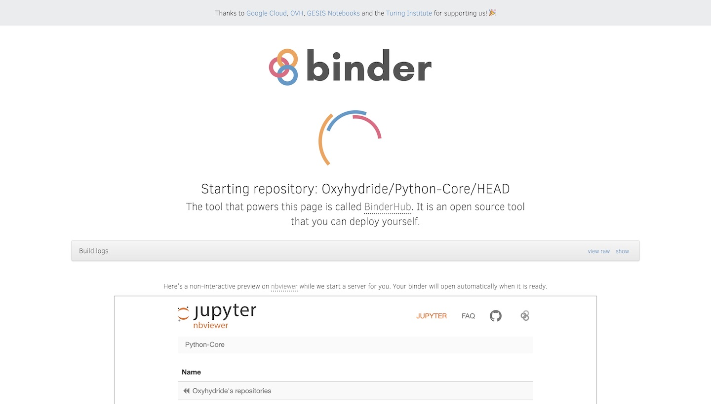
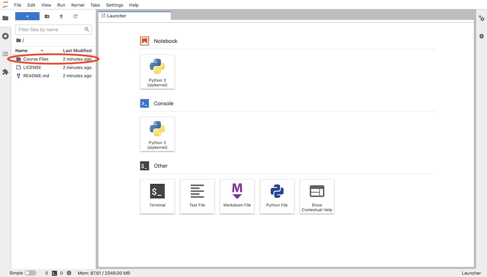
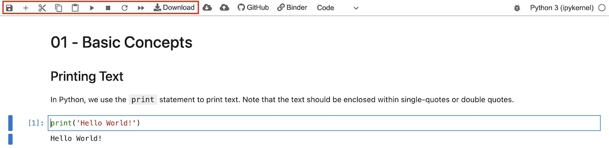

# Python Core Course
A beginner's Python course in the form of Jupyter Notebooks.
 
<a href="https://mybinder.org/v2/gh/Oxyhydride/Python-Core/main"></a>

Click "launch binder" above to launch the exercises in Binder, a read-only environment for Jupyter Notebooks. This means that your **progress will be erased when the browser tab is closed**. Download the notebook files you wish to keep: right-click on the file and click "Download". Alternatively, follow **Method 2** below to install Python on your local machine and learn from there.

The content of this course is primarily adapted from [Sololearn's Python Core](https://www.sololearn.com/learning/1073) course. However, exercises, discussions and assignments in the notebooks are authored by me.

## How to access the notebooks properly
### Method 1. Using Binder
1. Click "launch binder" above.
2. Wait for the binder instance to start. If you see a message `Too many users on this BinderHub! Try again soon.`, try to reload the page after a bit.



3. Once Binder has loaded, click on `Course Files`.



4. Inside the `Course Files` folder are subfolders of the course chapters. Each subfolder will (at least) contain:
    - A solution notebook
    - An *empty* notebook (i.e. with no solutions)
Double-click on the notebook to open it.
5. After selecting the Python interpreter (`Python 3 (ipykernel)`), you can use the toolbar to run cells.



### Method 2. Using Jupyter Notebook Locally
First, you'll need to install Python. This course uses Python 3 (more specifically Python 3.6 and above), so you'll need to install that first. Python 3 can be downloaded from [Python.org](https://www.python.org/downloads/).
- Choose the Python 3 version that suits you. This course assumes that the Python 3 version chosen is 3.6 and above.

Next [download this repository](https://github.com/PhotonicGluon/Python-Core/archive/refs/heads/main.zip) and unzip it. A folder named `Python-Core-main` should be obtained.

Now open the **Command Prompt** (on Windows) or **Terminal** (for Unix) and navigate to the `Python-Core-main` folder. You can do that by running
```bash
cd [ENTER_THE_PATH_TO_THE_FOLDER_HERE]
```
in the console.

Once there, run
```bash
python -m venv venv
```
or
```bash
python3 -m venv venv
````
if the above command does not work. This creates a *virtual environment* for you to open the notebooks. Next, run
```
source venv/bin/activate
```
to actually activate the virtual environment. A prompt near the start of the console like `(venv)` should appear.

Now, run
```bash
pip install -r requirements.txt
```
to install the needed requirements for opening the Jupyter notebooks.

Finally, to actually start accessing the Jupyter notebooks, run
```bash
jupyter notebook
```

In the future, to access the Jupyter notebooks easily, navigate back to the folder (from the Console/Terminal) and run the following commands.
```bash
source venv/bin/activate
jupyter notebook
```

## License
This repository is licensed under the MIT license. The full license agreement can be found in the [`LICENSE`](LICENSE) file. A copy of its contents is reproduced here.
```
MIT License

Copyright (c) 2020 Oxyhydride, 2023 PhotonicGluon

Permission is hereby granted, free of charge, to any person obtaining a copy
of this software and associated documentation files (the "Software"), to deal
in the Software without restriction, including without limitation the rights
to use, copy, modify, merge, publish, distribute, sublicense, and/or sell
copies of the Software, and to permit persons to whom the Software is
furnished to do so, subject to the following conditions:

The above copyright notice and this permission notice shall be included in all
copies or substantial portions of the Software.

THE SOFTWARE IS PROVIDED "AS IS", WITHOUT WARRANTY OF ANY KIND, EXPRESS OR
IMPLIED, INCLUDING BUT NOT LIMITED TO THE WARRANTIES OF MERCHANTABILITY,
FITNESS FOR A PARTICULAR PURPOSE AND NONINFRINGEMENT. IN NO EVENT SHALL THE
AUTHORS OR COPYRIGHT HOLDERS BE LIABLE FOR ANY CLAIM, DAMAGES OR OTHER
LIABILITY, WHETHER IN AN ACTION OF CONTRACT, TORT OR OTHERWISE, ARISING FROM,
OUT OF OR IN CONNECTION WITH THE SOFTWARE OR THE USE OR OTHER DEALINGS IN THE
SOFTWARE.
```
